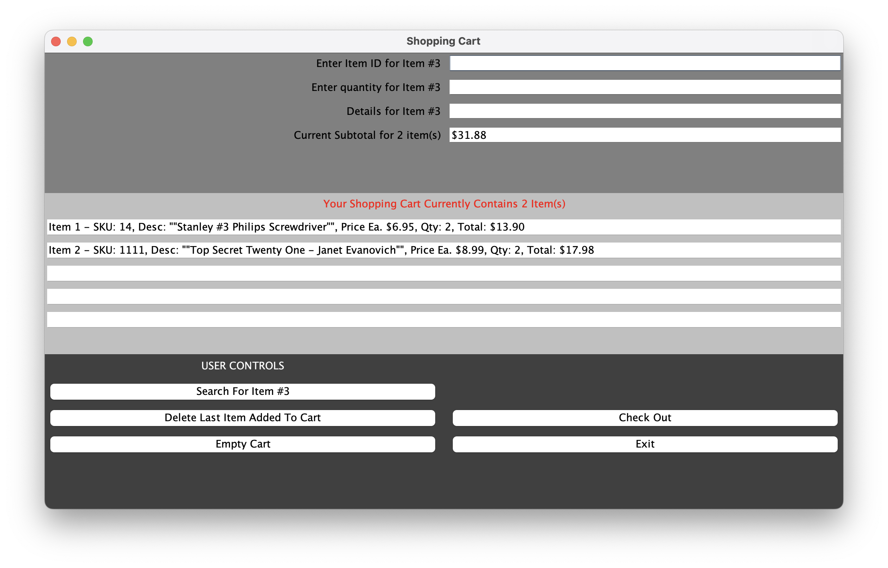
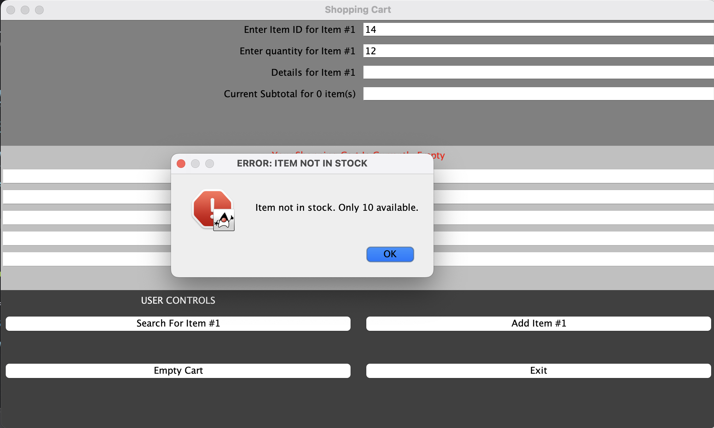
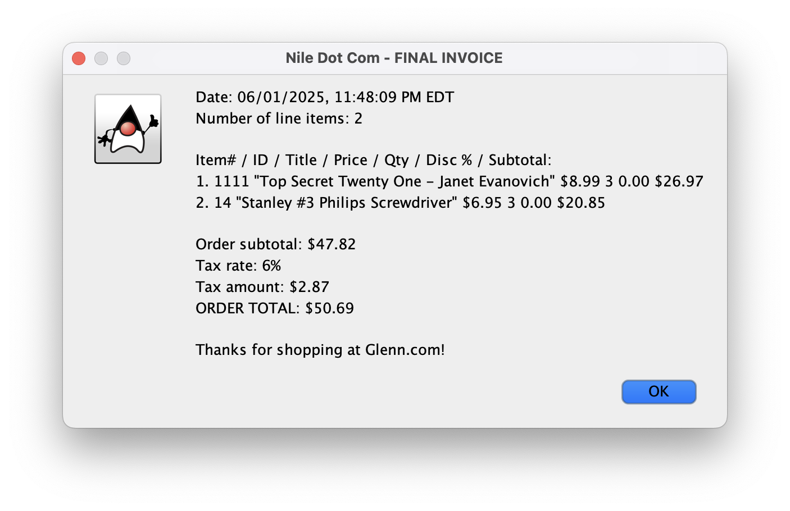
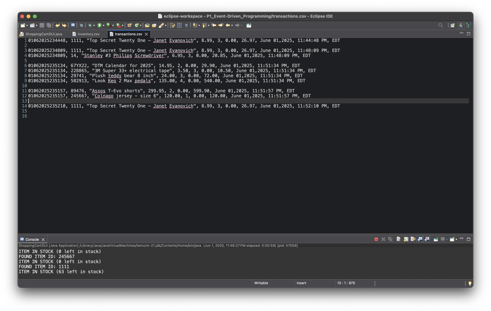

# Java Swing Enterprise Shopping Cart Simulation

## Description

* **Interactive Swing GUI**: Developed a graphical desktop interface using Java Swing (`javax.swing`) for smooth user interactions.
* **Inventory Search & Validation**: Real-time item lookup against a local CSV, validating stock levels, and calculating discounts based on order quantity.
* **Cart & State Management**: Supports dynamic adding, deleting, emptying the entire cart, subtotal calculations, and interactive status updating.
* **Event-Driven Architecture**: Structured around Java Swing action listeners and button handlers managing application workflow.
* **Transaction Logging**: Generates detailed checkout invoices and appends final order summaries into a CSV audit log (`transactions.csv`).

---

## Project Background

This project was developed for **CNT 4714: Enterprise Computing**, focusing on applying Java programming concepts to enterprise business logic, user interface design, and transactional data handling.

### Key Skills & Concepts Learned
* **GUI Development**: Creating and configuring windows, frames, panels, and input fields using Java Swing.
* **Event-Driven Programming**: Writing custom `ActionListener` event handlers for modular user interactions (Search, Add, Delete, Empty, Checkout, Exit).
* **File I/O & Audit Logging**: Reading from CSV inventory files and dynamically appending structured purchase timestamps and detailed lines to transaction files.

---

## Tech Stack & Requirements

* **Language**: Java (JDK 8 or higher)
* **GUI Toolkit**: Java Swing (`javax.swing`), AWT (`java.awt`)
* **Data Sources**: CSV file parsing (`inventory.csv` for item lookup, `transactions.csv` for ledger writing)

## Execution

1. **Prerequisites**: Ensure you have Java JDK installed on your machine.
2. **Setup Inventory File**: Use the provided inventory file or place your own `inventory.csv` file in the project root directory formatted as:
   ```csv
   1001, Item Title Description, true, 20, 19.99
   ```
3. **Compile**:
   ```bash
   javac eventDrivenProgramming/ShoppingCartGUI.java
   ```
4. **Run**:
   ```bash
   java eventDrivenProgramming.ShoppingCartGUI
   ```
---

## Screenshots & Application Flow

### 1. Main User Interface

*Description: The initial layout of the application showing the user input controls, interactive action buttons, and empty cart status.*

---

### 2. Inventory Validation

*Description: Searching for an item by ID and quantity. The application displays an error ('ERROR: ITEM NOT IN STOCK') with the quantity available.*

---

### 3. Checkout Invoice & Transaction Log

*Description: The final checkout modal showing the total invoice summary with tax calculations and transaction logging confirmation.*

---

### 4. Transaction Log View

*Description: The file (`transactions.csv`) shows all the completed transactions with trasnsaction ID, item ID, item name, item price, quantity purchased, discount applied, total, date & time.*

---


## Tiered Business Logic

The simulation evaluates item quantities upon search and dynamically updates total cost based on the following discount logic:

| Quantity Ordered | Applied Discount |
| :--- | :--- |
| **1 – 4 items** | 0% Discount |
| **5 – 9 items** | 10% Discount |
| **10 – 14 items** | 15% Discount |
| **15+ items** | 20% Discount |

---
